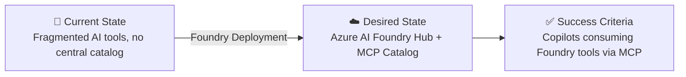

# 📋 Step 1: Requirements - Enterprise Foundry

<strong>📑 Requirements Overview</strong>

- [🎯 Project Overview](#-project-overview)
- [🚀 Functional Requirements](#-functional-requirements)
- [⚡ Non-Functional Requirements (NFRs)](#-non-functional-requirements-nfrs)
- [🔒 Compliance & Security Requirements](#-compliance--security-requirements)
- [💰 Budget](#-budget)
- [🔧 Operational Requirements](#-operational-requirements)
- [🌍 Regional Preferences](#-regional-preferences)
- [📊 Complexity Classification](#-complexity-classification)
- [📋 Summary for Architecture Assessment](#-summary-for-architecture-assessment)
- [References](#references)

> Generated by @requirements agent | 2026-03-12

| ⬅️ Previous | 📑 Index            | Next ➡️                                                        |
| ----------- | ------------------- | -------------------------------------------------------------- |
| —           | [README](README.md) | [02-architecture-assessment.md](02-architecture-assessment.md) |

## 🎯 Project Overview

| Field                   | Value                                                                         |
| ----------------------- | ----------------------------------------------------------------------------- |
| **Project Name**        | enterprise-foundry                                                            |
| **Project Type**        | Enterprise AI Platform                                                        |
| **Timeline**            | 2026-03-12 → 2026-06-30                                                       |
| **Primary Stakeholder** | Enterprise Architecture Team                                                  |
| **Business Context**    | Deploy Azure AI Foundry as the enterprise AI hub with MCP-based tool catalog  |

### Business Context

| Field               | Value                                                                              |
| ------------------- | ---------------------------------------------------------------------------------- |
| Industry / Vertical | Cross-industry enterprise                                                          |
| Company Size        | Enterprise                                                                         |
| Current State       | Greenfield AI platform deployment                                                  |
| Migration Source    | N/A — new AI capability                                                            |
| Business Drivers    | Centralise AI tooling, enable copilot integrations, expose Foundry tools via MCP   |
| Success Criteria    | Foundry Hub active, MCP catalog serving tools, connectors live for 3 integrations |

### State Transition

## 🚀 Functional Requirements

### Core Capabilities

| #  | Capability                                     | Priority      | Acceptance Criteria                                        |
| -- | ---------------------------------------------- | ------------- | ---------------------------------------------------------- |
| 1  | Azure AI Foundry Hub deployment                | 🔴 Must       | Hub created, projects can be registered                    |
| 2  | AI Foundry Project with model catalog          | 🔴 Must       | Project active, model deployments accessible               |
| 3  | MCP Server exposing Foundry tools              | 🔴 Must       | MCP server running, tools discoverable by copilots         |
| 4  | Foundry Catalog as central tool repository     | 🔴 Must       | Catalog populated, tools versioned and tagged              |
| 5  | Databricks MCP connector                       | 🔴 Must       | Databricks SQL/ML tools callable from copilot via MCP      |
| 6  | Salesforce MCP connector                       | 🔴 Must       | Salesforce CRM tools callable from copilot via MCP         |
| 7  | Microsoft 365 MCP connector                    | 🔴 Must       | M365 (Graph) tools callable from copilot via MCP           |
| 8  | Private network access for all Foundry services| 🟡 Should     | All PaaS endpoints reachable only via private endpoints    |
| 9  | Role-based access control for AI resources     | 🔴 Must       | Least-privilege RBAC applied to Hub, Project, Storage      |
| 10 | Monitoring and alerting for AI workloads       | 🟡 Should     | Log Analytics + Application Insights collecting telemetry  |

### User Types

| User Type           | Description                                   | Est. Count | Access Level   |
| ------------------- | --------------------------------------------- | ---------- | -------------- |
| AI Platform Admin   | Manages Foundry Hub, projects, and policies   | 5          | Owner on Hub   |
| AI Developer        | Creates model deployments and prompt flows    | 50         | Contributor    |
| Copilot Consumer    | Uses MCP tools from copilot experiences       | 500+       | Reader / MCP   |
| Data Engineer       | Connects Databricks workloads to Foundry      | 20         | Contributor    |

### Integrations

| System      | Direction    | Protocol       | Auth Method             | SLA    |
| ----------- | ------------ | -------------- | ----------------------- | ------ |
| Databricks  | Bidirectional| MCP over HTTPS | Service Principal / PAT | 99.9%  |
| Salesforce  | Outbound     | MCP over HTTPS | OAuth 2.0               | 99.9%  |
| M365 Graph  | Bidirectional| MCP over HTTPS | OAuth 2.0 / MI          | 99.9%  |
| Azure OpenAI| Inbound      | REST           | Managed Identity        | 99.9%  |

## ⚡ Non-Functional Requirements (NFRs)

| Category       | Requirement                     | Target                                  |
| -------------- | ------------------------------- | --------------------------------------- |
| Availability   | SLA                             | 99.9% for all production endpoints      |
| Performance    | MCP tool response time          | < 2 seconds p95                         |
| Scalability    | Concurrent MCP connections      | 1,000 concurrent clients                |
| Scalability    | Model deployments               | Support up to 20 concurrent deployments |
| Security       | Data encryption                 | At-rest and in-transit (TLS 1.2+)       |
| Security       | Network isolation               | Private endpoints for all PaaS services |
| Compliance     | Data residency                  | EU region (swedencentral)               |
| Observability  | Logging retention               | 90-day log retention                    |
| RTO / RPO      | Recovery objectives             | RTO 4h / RPO 1h                         |

## 🔒 Compliance & Security Requirements

| Requirement           | Standard / Control                 | Priority |
| --------------------- | ---------------------------------- | -------- |
| Data encryption       | AES-256 at rest, TLS 1.2 in transit| 🔴 Must  |
| Identity              | Managed Identity, no keys in code  | 🔴 Must  |
| Network               | Private endpoints, no public access| 🔴 Must  |
| RBAC                  | Least-privilege role assignments   | 🔴 Must  |
| Secrets               | Azure Key Vault for all secrets    | 🔴 Must  |
| Audit logging         | All API calls logged               | 🟡 Should|
| GDPR                  | Data residency in EU               | 🔴 Must  |

## 💰 Budget

| Category              | Estimated Monthly Cost (EUR) |
| --------------------- | ---------------------------- |
| Azure AI Foundry Hub  | ~300                         |
| Azure AI Services     | ~500 (usage-based)           |
| Storage               | ~50                          |
| Key Vault             | ~10                          |
| Networking (VNet, PE) | ~100                         |
| Monitoring            | ~80                          |
| **Total (estimated)** | **~1,040 / month**           |

## 🔧 Operational Requirements

| Area              | Requirement                                          |
| ----------------- | ---------------------------------------------------- |
| Deployment        | Infrastructure as Code (Bicep, AVM-first)            |
| CI/CD             | GitHub Actions for infra validation and deployment   |
| Monitoring        | Azure Monitor + Log Analytics + Application Insights |
| Alerting          | Budget alerts at 80%, 100%, 120%                     |
| Secrets rotation  | Key Vault with 90-day rotation policy                |
| Backup            | Soft-delete enabled on Key Vault and Storage         |
| MCP Server        | Container-based, horizontally scalable               |

## 🌍 Regional Preferences

| Resource Type    | Region         | Rationale                     |
| ---------------- | -------------- | ----------------------------- |
| All resources    | swedencentral  | EU GDPR-compliant, primary    |
| Failover (if DR) | germanywestcentral | EU paired region           |

## 📊 Complexity Classification

> **Classification: Complex (8-step workflow)**

| Dimension            | Value      | Rationale                                                    |
| -------------------- | ---------- | ------------------------------------------------------------ |
| Resource count       | 15+        | Hub, Project, AI Services, VNet, 3× PE, KV, Storage, etc.   |
| Integration count    | 4          | Databricks, Salesforce, M365, Azure OpenAI                   |
| Security posture     | High       | Private endpoints, RBAC, Key Vault mandatory                 |
| Custom MCP component | Yes        | Custom foundry-mcp Python server required                    |
| Compliance           | GDPR       | EU data residency required                                   |

## 📋 Summary for Architecture Assessment

**Deliver**:

1. Azure AI Foundry Hub in `swedencentral` as the enterprise AI control plane.
2. AI Foundry Project connected to the Hub with model deployments (GPT-4o, text-embedding).
3. Azure AI Catalog populated as the central tool repository accessible via MCP.
4. Python-based MCP server (`foundry-mcp`) that exposes Foundry tools to GitHub Copilot
   and other MCP clients.
5. MCP connector configurations for **Databricks** (data/ML), **Salesforce** (CRM),
   and **Microsoft 365** (Graph API) — each published as MCP servers reachable from
   the VS Code `mcp.json` and enterprise Copilot deployments.
6. Full private-network topology (VNet + private endpoints) with no public PaaS endpoints
   in production.
7. RBAC aligned to least-privilege: AI Developer, AI Platform Admin, Copilot Consumer.
8. Budget monitoring via `Microsoft.Consumption/budgets` at 1,040 EUR/month baseline.

## References

- [Azure AI Foundry documentation](https://learn.microsoft.com/en-us/azure/ai-studio/)
- [Model Context Protocol specification](https://modelcontextprotocol.io/)
- [Azure MCP Server](https://github.com/Azure/azure-mcp)
- [Databricks MCP connector](https://docs.databricks.com/en/generative-ai/agent-framework/mcp.html)
- [Microsoft Graph API](https://learn.microsoft.com/en-us/graph/overview)

<strong>📎 Additional Context</strong>

### Integration Architecture Reference

The MCP protocol enables copilots to discover and call tools without hard-coded integration
code. Each connector exposes a standard `list_tools` + `call_tool` interface.

### Security Considerations

All connectors authenticate with scoped service principals or managed identities.
No long-lived credentials are stored in code or configuration files — all secrets
are stored in Azure Key Vault and read at runtime.

### Cost Governance

A monthly budget of ~€1,040 is set with forecast alerts at 80%, 100%, and 120%.
The Azure AI Services (GPT-4o) is the primary cost driver (~50% of total).

