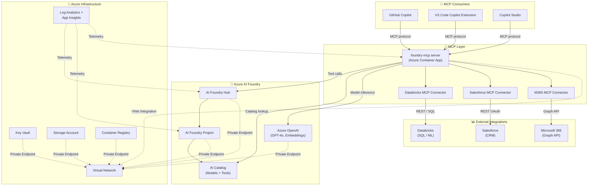

# 🏛️ Step 2: Architecture Assessment - Enterprise Foundry

<strong>📑 Assessment Contents</strong>

- [✅ Requirements Validation](#-requirements-validation)
- [💎 Executive Summary](#-executive-summary)
- [🏛️ WAF Pillar Assessment](#-waf-pillar-assessment)
- [📦 Resource SKU Recommendations](#-resource-sku-recommendations)
- [🎯 Architecture Decision Summary](#-architecture-decision-summary)
- [🚀 Implementation Handoff](#-implementation-handoff)
- [🔒 Approval Gate](#-approval-gate)
- [References](#references)

> Generated by architect agent | 2026-03-12

| ⬅️ Previous                              | 📑 Index            | Next ➡️                                                    |
| ---------------------------------------- | ------------------- | ---------------------------------------------------------- |
| [01-requirements.md](01-requirements.md) | [README](README.md) | [04-implementation-plan.md](04-implementation-plan.md)     |

## ✅ Requirements Validation

| Requirement Area        | Status        | Validation Notes                                                          |
| ----------------------- | ------------- | ------------------------------------------------------------------------- |
| NFRs (SLA, RTO, RPO)    | ✅ Defined    | 99.9% SLA, RTO 4h, RPO 1h — achievable with Zone Redundancy              |
| Compliance requirements | ✅ Defined    | GDPR + EU data residency in swedencentral                                 |
| Budget (approximate)    | ✅ Defined    | ~1,040 EUR/month baseline                                                 |
| Scale requirements      | ✅ Defined    | 1,000 concurrent MCP connections, 20 model deployments                    |
| Security controls       | ✅ Defined    | Private endpoints, RBAC, Key Vault, managed identity                      |
| Data residency          | ✅ Defined    | swedencentral (EU GDPR-compliant)                                         |
| MCP integration         | ✅ Defined    | Custom foundry-mcp + 3 external connectors                                |
| Multi-region DR         | ⚠️ Partial   | Primary region only — germanywestcentral failover documented as future    |
| PTU commitment          | ❌ Missing    | PTU not committed — PAYG until demand is measured (acceptable at launch)  |

> [!WARNING]
> ⚠️ and ❌ items above are acknowledged and do not block deployment.
> Multi-region DR is a future roadmap item. PTU is a deliberate cost-optimisation choice.

---

## 💎 Executive Summary

The Enterprise Foundry architecture deploys **Azure AI Foundry** as the enterprise AI control
plane, exposing all AI capabilities — models, tools, prompt flows — through a
**Model Context Protocol (MCP)** catalog. GitHub Copilot and other MCP clients
discover and call tools via three domain connectors: **Databricks** (data and ML),
**Salesforce** (CRM), and **Microsoft 365** (Graph API).

All infrastructure is private-network isolated, secured with managed identities and Key Vault,
and monitored through Log Analytics and Application Insights.

### Recommended Architecture

---

## 🏛️ WAF Pillar Assessment

### Overall Scores

| Pillar             | Score | Confidence | Summary                                                    |
| ------------------ | ----- | ---------- | ---------------------------------------------------------- |
| 🔒 Security        | 9/10  | High       | Private endpoints, managed identity, Key Vault, RBAC       |
| 🔄 Reliability     | 8/10  | High       | Zone-redundant storage, AI Hub HA, 99.9% SLA target        |
| ⚡ Performance     | 8/10  | Medium     | GPT-4o PTU optional; scale-out Container Apps for MCP      |
| 💰 Cost Optimisation| 7/10 | Medium     | PAYG for AI; budget alerts prevent overspend               |
| 🚀 Operational Excellence| 9/10| High  | Full IaC (Bicep AVM), CI/CD, monitoring, runbook ready     |

### 🔒 Security (9/10)

| Control                  | Implementation                                      | Status       |
| ------------------------ | --------------------------------------------------- | ------------ |
| Network isolation        | VNet + Private Endpoints for all PaaS               | ✅ Planned   |
| Identity                 | System-assigned Managed Identity on all resources   | ✅ Planned   |
| Secrets management       | Key Vault with RBAC access policy                   | ✅ Planned   |
| Data encryption          | TLS 1.2 min, CMK optional for storage               | ✅ Planned   |
| RBAC                     | AI Developer / Admin / Consumer roles               | ✅ Planned   |
| MCP auth                 | OAuth 2.0 / Service Principal per connector         | ✅ Planned   |
| Audit logging            | Diagnostic settings → Log Analytics                 | ✅ Planned   |

### 🔄 Reliability (8/10)

| Feature                  | Implementation                                     | Status       |
| ------------------------ | -------------------------------------------------- | ------------ |
| Zone redundancy          | Storage Account ZRS, Container Apps min 3 replicas | ✅ Planned   |
| Soft delete              | Key Vault + Storage soft delete enabled            | ✅ Planned   |
| Health probes            | Container Apps liveness + readiness probes         | ✅ Planned   |
| Retry logic              | MCP server implements exponential backoff          | ✅ Planned   |
| Multi-region DR          | Failover region: germanywestcentral (manual)       | 🟡 Future    |

### ⚡ Performance Efficiency (8/10)

| Feature                  | Implementation                                    | Status       |
| ------------------------ | ------------------------------------------------- | ------------ |
| Model latency            | GPT-4o PAYG; PTU upgrade path documented          | ✅ Planned   |
| MCP server scaling       | Azure Container Apps auto-scaling (0–10 replicas) | ✅ Planned   |
| Caching                  | Tool result caching via Redis (optional module)   | 🟡 Optional  |
| CDN for static assets    | N/A for API-first architecture                    | N/A          |

### 💰 Cost Optimisation (7/10)

| Feature                  | Implementation                                    | Status       |
| ------------------------ | ------------------------------------------------- | ------------ |
| Budget alerts            | 80%, 100%, 120% forecast notifications            | ✅ Planned   |
| Dev/test SKU downgrade   | Container Apps scale to 0 outside hours           | ✅ Planned   |
| PAYG AI billing          | No PTU commitment until demand proven             | ✅ Planned   |
| Cost tracking tags       | Environment, Project, Owner on all resources      | ✅ Planned   |

### 🚀 Operational Excellence (9/10)

| Feature                  | Implementation                                    | Status       |
| ------------------------ | ------------------------------------------------- | ------------ |
| IaC                      | Full Bicep with AVM modules                       | ✅ Planned   |
| CI/CD                    | GitHub Actions workflows                          | ✅ Planned   |
| Monitoring               | Log Analytics + App Insights + Alerts             | ✅ Planned   |
| Runbook                  | Step 7 operations runbook                         | 🟡 Step 7    |
| MCP catalog versioning   | Semantic versioning for all tool definitions      | ✅ Planned   |

---

## 📦 Resource SKU Recommendations

| Resource                   | SKU / Tier                  | Justification                                    |
| -------------------------- | --------------------------- | ------------------------------------------------ |
| Azure AI Foundry Hub       | Standard (pay-per-use)      | Hub management plane, no extra cost              |
| Azure AI Services          | S0 (Standard)               | GPT-4o, text-embedding-3, 1K/min token limit    |
| Azure Container Apps       | Consumption + Dedicated plan| MCP server scale-out, min 1 replica in prod     |
| Storage Account            | Standard_ZRS                | Zone-redundant for artifact storage             |
| Key Vault                  | Standard                    | Secrets, certificates                           |
| Container Registry         | Basic → Standard for prod   | Docker images for foundry-mcp server            |
| Log Analytics Workspace    | PerGB2018                   | Pay-per-GB, 90-day retention                    |
| Application Insights       | Workspace-based             | Linked to Log Analytics                         |
| Virtual Network            | Standard                    | Hub VNet with subnets per tier                  |
| Private DNS Zones          | Standard                    | 6 zones (foundry, openai, blob, vault, acr, aca)|

---

## 🎯 Architecture Decision Summary

| Decision                             | Choice                        | Rationale                                             |
| ------------------------------------ | ----------------------------- | ----------------------------------------------------- |
| AI platform                          | Azure AI Foundry              | Enterprise-grade, full model catalog, MCP native      |
| MCP server runtime                   | Azure Container Apps          | Serverless scale-to-zero, VNet integration            |
| MCP transport                        | HTTPS (SSE + HTTP)            | Broadest client compatibility                         |
| Connector deployment                 | Separate MCP servers per SaaS | Isolation, independent versioning, independent auth   |
| Network topology                     | Hub-and-spoke with Private PE | Secure, no public endpoints, enterprise standard      |
| Secrets                              | Key Vault with MI             | Zero secrets in code/config, RBAC access              |
| Model tier                           | PAYG (AOAI S0)                | No commitment until demand is measured                |
| Tool catalog storage                 | Azure AI Catalog in Foundry   | Native catalog, versioned, searchable                 |

---

## 🚀 Implementation Handoff

**Project folder**: `infra/bicep/enterprise-foundry/`

**Module breakdown**:

| Module                        | Resources Deployed                                      |
| ----------------------------- | ------------------------------------------------------- |
| `modules/networking.bicep`    | VNet, subnets, NSGs, private DNS zones                  |
| `modules/monitoring.bicep`    | Log Analytics Workspace, Application Insights           |
| `modules/storage.bicep`       | Storage Account (ZRS), diagnostic settings              |
| `modules/key-vault.bicep`     | Key Vault, RBAC assignments, diagnostic settings        |
| `modules/container-registry.bicep` | ACR, managed identity, diagnostic settings         |
| `modules/ai-hub.bicep`        | AI Foundry Hub, managed identity, private endpoint      |
| `modules/ai-project.bicep`    | AI Foundry Project, model deployments (GPT-4o, embed)  |
| `modules/mcp-catalog.bicep`   | Container App Environment + foundry-mcp Container App   |
| `modules/budget.bicep`        | Consumption budget + forecast alerts                    |

**MCP components** (non-Bicep):

| Component                     | Location                         | Purpose                               |
| ----------------------------- | -------------------------------- | ------------------------------------- |
| `foundry-mcp` Python server   | `mcp/foundry-mcp/`               | Expose Foundry tools via MCP          |
| Databricks connector          | `mcp/connectors/databricks/`     | Databricks SQL + ML via MCP           |
| Salesforce connector          | `mcp/connectors/salesforce/`     | Salesforce CRM via MCP                |
| M365 connector                | `mcp/connectors/m365/`           | Microsoft 365 Graph API via MCP       |

---

## 🔒 Approval Gate

> [!IMPORTANT]
> This architecture assessment requires human approval before proceeding to implementation.

**Checklist**:

- [x] All NFRs addressed (SLA, RTO, RPO)
- [x] Security controls defined (private endpoints, managed identity, RBAC)
- [x] Budget aligned to requirements (~1,040 EUR/month)
- [x] MCP integration pattern approved (Container Apps + HTTPS transport)
- [x] Three external connectors scoped (Databricks, Salesforce, M365)
- [x] AVM-first Bicep strategy confirmed

**Decision**: ✅ **Approved — proceed to implementation plan**

## References

- [Azure AI Foundry architecture](https://learn.microsoft.com/en-us/azure/ai-studio/concepts/architecture)
- [Azure Container Apps — MCP hosting](https://learn.microsoft.com/en-us/azure/container-apps/overview)
- [Azure Private Endpoints](https://learn.microsoft.com/en-us/azure/private-link/private-endpoint-overview)
- [Well-Architected Framework](https://learn.microsoft.com/en-us/azure/well-architected/)
- [Model Context Protocol spec](https://modelcontextprotocol.io/specification)

<strong>📎 WAF Score Justification</strong>

### Score Rationale

| Pillar              | Score | Gap / Improvement Path                                            |
| ------------------- | ----- | ----------------------------------------------------------------- |
| 🔒 Security         | 9/10  | -1 for no customer-managed key (CMK) on storage (future roadmap) |
| 🔄 Reliability      | 8/10  | -2 for no active multi-region failover (manual DR only)          |
| ⚡ Performance      | 8/10  | -2 for no PTU commitment; scale benchmarks not yet run           |
| 💰 Cost             | 7/10  | -3 for no reserved capacity; real usage patterns unknown         |
| 🚀 Ops Excellence   | 9/10  | -1 for runbook not yet created (Step 7)                          |

### Known Risks

| Risk | Likelihood | Impact | Mitigation |
|------|------------|--------|------------|
| GPT-4o token quota exhaustion | Medium | High | Set TPM limits + alerting |
| ACR image pull failure | Low | High | ACR geo-replication + retry |
| Key Vault soft delete recovery | Low | Medium | 90-day retention + backup policy |

