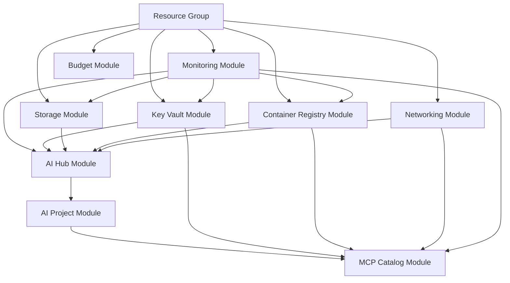
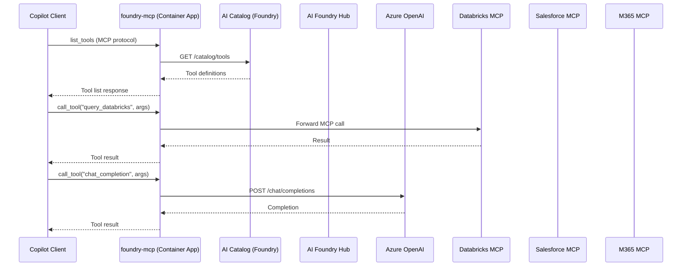

# 📀 Step 4: Implementation Plan - Enterprise Foundry


<details open>
<summary><strong>📑 Implementation Contents</strong></summary>

- [📋 Overview](#-overview)
- [📦 Resource Inventory](#-resource-inventory)
- [🗂️ Module Structure](#-module-structure)
- [🔨 Implementation Tasks](#-implementation-tasks)
- [🚀 Deployment Phases](#-deployment-phases)
- [🔗 Dependency Graph](#-dependency-graph)
- [🔄 Runtime Flow Diagram](#-runtime-flow-diagram)
- [🏷️ Naming Conventions](#-naming-conventions)
- [🔐 Security Configuration](#-security-configuration)
- [⏱️ Estimated Implementation Time](#-estimated-implementation-time)
- [🔒 Approval Gate](#-approval-gate)
- [References](#references)

</details>

> Generated by bicep-plan agent | 2026-03-12

| ⬅️ Previous                                                            | 📑 Index            | Next ➡️                    |
| ---------------------------------------------------------------------- | ------------------- | -------------------------- |
| [02-architecture-assessment.md](02-architecture-assessment.md)         | [README](README.md) | Bicep Code Generation      |

## 📋 Overview

Deploy the **Enterprise Foundry** platform — an Azure AI Foundry Hub with MCP-based tool catalog
and three external connectors (Databricks, Salesforce, M365). All resources are deployed in
`swedencentral`, secured with private endpoints and managed identities, and monitored via
Log Analytics and Application Insights.

The Bicep templates follow an AVM-first strategy. The MCP server (`foundry-mcp`) runs as a
Python application on Azure Container Apps and exposes the Foundry tool catalog to copilots
and other MCP clients.

---

## 📦 Resource Inventory

| Resource                     | Type                                       | SKU              | AVM Status | Dependencies                    | Status  |
| ---------------------------- | ------------------------------------------ | ---------------- | ---------- | ------------------------------- | ------- |
| Resource Group               | `Microsoft.Resources/resourceGroups`       | N/A              | ✅ AVM     | —                               | ⬜ Todo |
| Log Analytics Workspace      | `Microsoft.OperationalInsights/workspaces` | PerGB2018        | ✅ AVM     | —                               | ⬜ Todo |
| Application Insights         | `Microsoft.Insights/components`            | Workspace-based  | ✅ AVM     | Log Analytics                   | ⬜ Todo |
| Key Vault                    | `Microsoft.KeyVault/vaults`                | Standard         | ✅ AVM     | Log Analytics                   | ⬜ Todo |
| Storage Account              | `Microsoft.Storage/storageAccounts`        | Standard_ZRS     | ✅ AVM     | Log Analytics                   | ⬜ Todo |
| Container Registry           | `Microsoft.ContainerRegistry/registries`   | Standard         | ✅ AVM     | Log Analytics                   | ⬜ Todo |
| Virtual Network              | `Microsoft.Network/virtualNetworks`        | Standard         | ✅ AVM     | —                               | ⬜ Todo |
| Private DNS Zones (×6)       | `Microsoft.Network/privateDnsZones`        | N/A              | ✅ AVM     | VNet                            | ⬜ Todo |
| AI Foundry Hub               | `Microsoft.MachineLearningServices/workspaces` | Standard     | ✅ AVM     | Storage, KV, ACR, Monitor, VNet | ⬜ Todo |
| AI Foundry Project           | `Microsoft.MachineLearningServices/workspaces` | Standard     | ✅ AVM     | AI Hub                          | ⬜ Todo |
| Azure AI Services            | `Microsoft.CognitiveServices/accounts`     | S0               | ✅ AVM     | Log Analytics, VNet             | ⬜ Todo |
| Container App Environment    | `Microsoft.App/managedEnvironments`        | Consumption      | ✅ AVM     | VNet, Log Analytics             | ⬜ Todo |
| foundry-mcp Container App    | `Microsoft.App/containerApps`              | Consumption      | ✅ AVM     | CAE, ACR, KV, AI Services       | ⬜ Todo |
| Budget                       | `Microsoft.Consumption/budgets`            | Monthly          | N/A        | Resource Group                  | ⬜ Todo |
| RBAC Assignments             | `Microsoft.Authorization/roleAssignments`  | N/A              | ✅ AVM     | All resources                   | ⬜ Todo |

---

## 🗂️ Module Structure

```text
infra/bicep/enterprise-foundry/
├── main.bicep                  # Root orchestration
├── main.bicepparam             # Parameter file (prod defaults)
├── modules/
│   ├── monitoring.bicep        # Log Analytics + Application Insights
│   ├── key-vault.bicep         # Key Vault + RBAC + diagnostics
│   ├── storage.bicep           # Storage Account + diagnostics
│   ├── container-registry.bicep# ACR + managed identity + diagnostics
│   ├── networking.bicep        # VNet + subnets + NSGs + private DNS zones
│   ├── ai-hub.bicep            # Azure AI Foundry Hub + private endpoint
│   ├── ai-project.bicep        # AI Foundry Project + model deployments
│   ├── mcp-catalog.bicep       # Container App Env + foundry-mcp app
│   └── budget.bicep            # Cost budget + forecast alerts
└── deploy.ps1                  # PowerShell deployment script
```

| Module                     | AVM Source                                               | Purpose                              |
| -------------------------- | -------------------------------------------------------- | ------------------------------------ |
| `monitoring.bicep`         | `br/public:avm/res/operational-insights/workspace`       | Central observability                |
| `key-vault.bicep`          | `br/public:avm/res/key-vault/vault`                      | Secrets management                   |
| `storage.bicep`            | `br/public:avm/res/storage/storage-account`              | Foundry artifact store               |
| `container-registry.bicep` | `br/public:avm/res/container-registry/registry`          | foundry-mcp Docker image store       |
| `networking.bicep`         | `br/public:avm/res/network/virtual-network`              | Isolated network topology            |
| `ai-hub.bicep`             | `br/public:avm/res/machine-learning-services/workspace`  | Foundry Hub control plane            |
| `ai-project.bicep`         | `br/public:avm/res/machine-learning-services/workspace`  | Foundry Project + models             |
| `mcp-catalog.bicep`        | `br/public:avm/res/app/managed-environment`              | MCP server runtime                   |
| `budget.bicep`             | Raw Bicep (no AVM module)                                | Cost guard rails                     |

---

## 🔨 Implementation Tasks

### Task 1: main.bicep (Root Orchestration)

**Purpose**: Entry point — orchestrates all modules and passes shared parameters.

**Parameters**:

- `projectName` (string, no default) — drives all resource names
- `environment` (string: `dev`, `staging`, `prod`)
- `location` (string, default: `swedencentral`)
- `tags` (object) — merged with module-level tags
- `budgetAmount` (int, default: `1040`)
- `alertEmail` (string) — budget + anomaly alerts recipient
- `mcpImageTag` (string, default: `latest`) — foundry-mcp container tag

**Variables**:

- `uniqueSuffix = uniqueString(resourceGroup().id)` — generated once, passed everywhere
- `shortName = take(projectName, 8)` — for length-constrained resources

### Task 2: monitoring.bicep

**Purpose**: Deploy Log Analytics Workspace and Application Insights.

**Outputs**: `workspaceId`, `workspaceName`, `appInsightsConnectionString`, `appInsightsKey`

### Task 3: key-vault.bicep

**Purpose**: Deploy Key Vault with RBAC, soft-delete, and diagnostic settings linked to Log Analytics.

**Key settings**:

- `enableSoftDelete: true`, `softDeleteRetentionInDays: 90`
- `enablePurgeProtection: true`
- `enableRbacAuthorization: true`
- Private endpoint in `snet-private-endpoints`

### Task 4: storage.bicep

**Purpose**: Deploy Storage Account for Foundry artifacts (model checkpoints, datasets).

**Key settings**:

- `sku: Standard_ZRS`
- `minimumTlsVersion: TLS1_2`
- `allowBlobPublicAccess: false`
- `supportsHttpsTrafficOnly: true`
- Private endpoints for blob and file services

### Task 5: container-registry.bicep

**Purpose**: ACR to host foundry-mcp Docker image.

**Key settings**:

- SKU: `Standard` (enables geo-replication path for DR)
- Admin user disabled — push/pull via managed identity
- Private endpoint in `snet-private-endpoints`

### Task 6: networking.bicep

**Purpose**: VNet with subnet segmentation, NSGs, and private DNS zones.

**Subnets**:

| Subnet                   | CIDR           | Purpose                              |
| ------------------------ | -------------- | ------------------------------------ |
| `snet-foundry`           | 10.0.1.0/24    | Foundry Hub and Project resources    |
| `snet-mcp`               | 10.0.2.0/24    | Container Apps Environment           |
| `snet-private-endpoints` | 10.0.3.0/24    | All PaaS private endpoints           |

**Private DNS Zones**:

| Zone                                             | Service              |
| ------------------------------------------------ | -------------------- |
| `privatelink.api.azureml.ms`                     | Azure ML / AI Hub    |
| `privatelink.notebooks.azure.net`                | AI Hub notebooks     |
| `privatelink.openai.azure.com`                   | Azure OpenAI         |
| `privatelink.blob.core.windows.net`              | Storage (blob)       |
| `privatelink.vaultcore.azure.net`                | Key Vault            |
| `privatelink.azurecr.io`                         | Container Registry   |
| `privatelink.azurecontainerapps.io`              | Container Apps       |

### Task 7: ai-hub.bicep

**Purpose**: Azure AI Foundry Hub — the enterprise AI control plane.

**Key settings**:

- `kind: Hub`
- System-assigned managed identity
- Private endpoint in `snet-private-endpoints`
- Linked to Storage, Key Vault, ACR, Application Insights

**RBAC assignments**:

| Role                             | Principal               | Scope |
| -------------------------------- | ----------------------- | ----- |
| `AzureML Data Scientist`         | AI Developer group      | Hub   |
| `AzureML Workspace Connection Creator` | AI Developer group| Hub   |

### Task 8: ai-project.bicep

**Purpose**: AI Foundry Project workspace with GPT-4o and text-embedding model deployments.

**Model deployments**:

| Model                     | Deployment Name             | SKU      | TPM Limit |
| ------------------------- | --------------------------- | -------- | --------- |
| `gpt-4o`                  | `gpt-4o-deployment`         | Standard | 150K      |
| `text-embedding-3-large`  | `embedding-deployment`      | Standard | 350K      |

### Task 9: mcp-catalog.bicep

**Purpose**: Container App Environment and foundry-mcp Container App.

**Container App settings**:

- Image: `{acrName}.azurecr.io/foundry-mcp:{mcpImageTag}`
- Ingress: external HTTPS, port 8080
- Min replicas: 1 (prod), 0 (dev)
- Max replicas: 10
- Environment variables (from Key Vault references):
  - `AZURE_FOUNDRY_HUB_URL`
  - `AZURE_AI_SERVICES_ENDPOINT`
  - `AZURE_AI_SERVICES_KEY` (from KV)
  - `FOUNDRY_PROJECT_NAME`

### Task 10: budget.bicep

**Purpose**: Monthly budget with three forecast-based alerts.

| Threshold | Type     | Notification target   |
| --------- | -------- | --------------------- |
| 80%       | Forecast | `alertEmail` parameter|
| 100%      | Forecast | `alertEmail` parameter|
| 120%      | Forecast | `alertEmail` parameter|

---

## 🚀 Deployment Phases

### Phase 1 — Foundation (Day 1)

1. Deploy resource group
2. Deploy monitoring (Log Analytics + App Insights)
3. Deploy Key Vault
4. Deploy Storage Account
5. Deploy Container Registry
6. Deploy Virtual Network + private DNS zones

### Phase 2 — AI Platform (Day 2)

7. Deploy Azure AI Services (Cognitive Services)
8. Deploy AI Foundry Hub (linked to Phase 1 resources)
9. Deploy AI Foundry Project with model deployments

### Phase 3 — MCP Layer (Day 3)

10. Build and push `foundry-mcp` Docker image to ACR
11. Deploy Container App Environment
12. Deploy foundry-mcp Container App
13. Deploy budget + alerts

### Phase 4 — Connector Configuration (Day 3–4)

14. Configure Databricks MCP connector (`mcp/connectors/databricks/`)
15. Configure Salesforce MCP connector (`mcp/connectors/salesforce/`)
16. Configure M365 MCP connector (`mcp/connectors/m365/`)
17. Update `.vscode/mcp.json` to register all four MCP servers

---

## 🔗 Dependency Graph


Source: [04-dependency-diagram.py](./04-dependency-diagram.py)



---

## 🔄 Runtime Flow Diagram


Source: [04-runtime-diagram.py](./04-runtime-diagram.py)



---

## 🏷️ Naming Conventions

All names derived from `projectName` parameter + `uniqueSuffix`:

| Resource            | Pattern                                  | Example (projectName=foundry, env=prod) |
| ------------------- | ---------------------------------------- | --------------------------------------- |
| Resource Group      | `rg-{projectName}-{env}`                 | `rg-foundry-prod`                       |
| Log Analytics       | `log-{projectName}-{env}`                | `log-foundry-prod`                      |
| Key Vault           | `kv-{short}-{env}-{suffix}`              | `kv-foundr-prod-7xk2`                   |
| Storage Account     | `st{short}{env}{suffix}`                 | `stfoundryprod7xk2`                     |
| Container Registry  | `cr{short}{env}{suffix}`                 | `crfoundryprod7xk2`                     |
| Virtual Network     | `vnet-{projectName}-{env}`               | `vnet-foundry-prod`                     |
| AI Hub              | `hub-{projectName}-{env}`                | `hub-foundry-prod`                      |
| AI Project          | `proj-{projectName}-{env}`               | `proj-foundry-prod`                     |
| AI Services         | `ais-{projectName}-{env}-{suffix}`       | `ais-foundry-prod-7xk2`                 |
| Container App Env   | `cae-{projectName}-{env}`                | `cae-foundry-prod`                      |
| foundry-mcp App     | `app-foundry-mcp-{env}`                  | `app-foundry-mcp-prod`                  |

---

## 🔐 Security Configuration

| Resource          | Control                           | Value                              |
| ----------------- | --------------------------------- | ---------------------------------- |
| Key Vault         | enableRbacAuthorization           | `true`                             |
| Key Vault         | enableSoftDelete                  | `true` (90-day retention)          |
| Key Vault         | enablePurgeProtection             | `true`                             |
| Key Vault         | publicNetworkAccess               | `Disabled`                         |
| Storage           | minimumTlsVersion                 | `TLS1_2`                           |
| Storage           | allowBlobPublicAccess             | `false`                            |
| Storage           | supportsHttpsTrafficOnly          | `true`                             |
| Storage           | publicNetworkAccess               | `Disabled`                         |
| AI Services       | publicNetworkAccess               | `Disabled`                         |
| AI Hub            | publicNetworkAccess               | `Disabled`                         |
| Container Registry| adminUserEnabled                  | `false`                            |
| Container Registry| publicNetworkAccess               | `Disabled`                         |
| Container Apps    | ingress.external                  | `true` (HTTPS only)                |
| All resources     | Managed Identity                  | System-assigned                    |
| All resources     | Minimum TLS                       | 1.2                                |

---

## ⏱️ Estimated Implementation Time

| Task                              | Effort  |
| --------------------------------- | ------- |
| Bicep templates (9 modules)       | 4 hours |
| foundry-mcp Python MCP server     | 3 hours |
| Databricks connector config       | 1 hour  |
| Salesforce connector config       | 1 hour  |
| M365 connector config             | 1 hour  |
| Deploy + validate                 | 2 hours |
| **Total**                         | **12 hours** |

---

## 🔒 Approval Gate

> [!IMPORTANT]
> Approve this plan before Bicep code generation begins.

**Checklist**:

- [x] Resource inventory complete (14 resources + RBAC)
- [x] Module structure defined (9 Bicep modules)
- [x] Deployment phases clear (4 phases, 4 days)
- [x] Naming conventions aligned to CAF
- [x] Security controls specified per resource
- [x] MCP layer architecture approved
- [x] Three connectors scoped (Databricks, Salesforce, M365)

**Decision**: ✅ **Approved — proceed to Bicep code generation**

## References

- [Azure AI Foundry Bicep reference](https://learn.microsoft.com/en-us/azure/templates/microsoft.machinelearningservices/workspaces)
- [Azure Container Apps Bicep reference](https://learn.microsoft.com/en-us/azure/templates/microsoft.app/containerapps)
- [AVM module catalog](https://azure.github.io/Azure-Verified-Modules/)
- [MCP server on Container Apps](https://learn.microsoft.com/en-us/azure/container-apps/overview)
