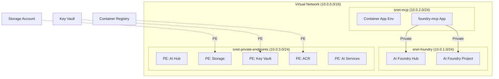

# Enterprise Foundry — Bicep Templates

> Azure AI Foundry Hub + MCP Catalog + Private Networking
> Deployed in `swedencentral` (EU GDPR-compliant)

## Architecture



## Quick Start

### Prerequisites

- Azure CLI with Bicep extension (`az bicep install`)
- Authenticated Azure session (`az login`)
- Resource group already created or script creates it

### Deploy

```powershell
cd infra/bicep/enterprise-foundry

# Preview changes (no deployment)
./deploy.ps1 -ResourceGroupName rg-foundry-prod -WhatIf

# Deploy
./deploy.ps1 -ResourceGroupName rg-foundry-prod
```

### Parameters

Edit `main.bicepparam` before deploying:

| Parameter | Required | Default | Description |
|-----------|----------|---------|-------------|
| `projectName` | ✅ | — | Project name (drives all resource names) |
| `alertEmail` | ✅ | — | Budget and alert notification email |
| `environment` | | `prod` | `dev`, `staging`, or `prod` |
| `location` | | `swedencentral` | Azure region |
| `budgetAmount` | | `1040` | Monthly budget in EUR |
| `mcpImageTag` | | `latest` | foundry-mcp Docker image tag |

### Build & Validate

```bash
# Syntax check
bicep build main.bicep

# Lint (best practices)
bicep lint main.bicep

# What-if preview
az deployment group what-if \
  --resource-group rg-foundry-prod \
  --template-file main.bicep \
  --parameters main.bicepparam
```

## Module Reference

| Module | AVM Source | Purpose |
|--------|-----------|---------|
| `monitoring.bicep` | `avm/res/operational-insights/workspace` + `avm/res/insights/component` | Log Analytics + App Insights |
| `key-vault.bicep` | `avm/res/key-vault/vault` | Secrets management |
| `storage.bicep` | `avm/res/storage/storage-account` | Foundry artifact storage |
| `container-registry.bicep` | `avm/res/container-registry/registry` | Docker images for foundry-mcp |
| `networking.bicep` | `avm/res/network/virtual-network` + `avm/res/network/private-dns-zone` | VNet + private DNS |
| `ai-hub.bicep` | `avm/res/machine-learning-services/workspace` | AI Foundry Hub |
| `ai-project.bicep` | `avm/res/machine-learning-services/workspace` + `avm/res/cognitive-services/account` | AI Project + models |
| `mcp-catalog.bicep` | `avm/res/app/managed-environment` + `avm/res/app/container-app` | foundry-mcp runtime |
| `budget.bicep` | Raw Bicep (`Microsoft.Consumption/budgets`) | Cost guard rails |

## Post-Deployment

After deployment, complete these steps:

1. **Build and push the foundry-mcp Docker image**:

   ```bash
   cd mcp/foundry-mcp
   ACR=$(az deployment group show -g rg-foundry-prod -n <deploy-name> \
     --query 'properties.outputs.acrLoginServer.value' -o tsv)
   az acr build --registry $ACR --image foundry-mcp:latest .
   ```

2. **Configure MCP connectors** — see:
   - [`mcp/connectors/databricks/README.md`](../../../mcp/connectors/databricks/README.md)
   - [`mcp/connectors/salesforce/README.md`](../../../mcp/connectors/salesforce/README.md)
   - [`mcp/connectors/m365/README.md`](../../../mcp/connectors/m365/README.md)

3. **Register MCP servers in VS Code** — set the required environment variables and
   verify `.vscode/mcp.json` is loaded by VS Code Copilot.

4. **Validate** — open GitHub Copilot Chat and run:

   ```text
   @workspace Use the foundry-mcp tool to list catalog tools
   ```

## Related Artifacts

- [Requirements](../../../agent-output/enterprise-foundry/01-requirements.md)
- [Architecture Assessment](../../../agent-output/enterprise-foundry/02-architecture-assessment.md)
- [Implementation Plan](../../../agent-output/enterprise-foundry/04-implementation-plan.md)
